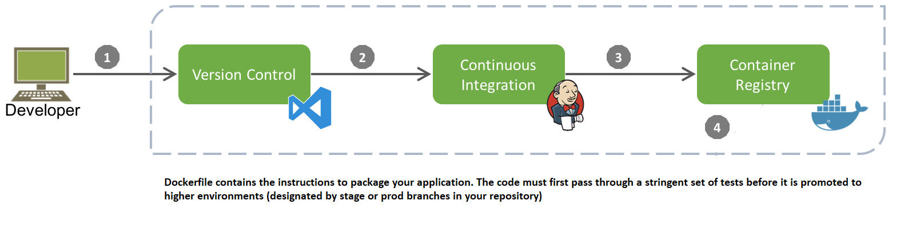

# Cloud Natively

Hello there! Welcome to this portal. 

The intent of this portal is to provide you with a comprehensive overview of what a cloud native application is, it's benefits on software delivery and how you can approach building cloud native applications.

We start with a high level overview of what a _Cloud Native_ software application is, and then delve deeper into the various constituents. Hope you enjoy this guide!

> Cloud Natively - A comprehensive overview of Cloud Native applications

## What is Cloud Native?

Cloud Native applications allow your organization to ship faster, reduce risk, and grow your business.

> Cloud native is an approach to building and running applications that exploits the advantages of the cloud computing delivery model. When companies build and operate applications using a cloud native architecture, they bring new ideas to market faster and respond sooner to customer demands.

> Cloud Native is the answer to the software industry’s relentless search in the current decade for a set of tools and practices that makes your software easily deployable, modular, maintainable, robust, reliable, scalable, portable and observable — all at once.

Under the hood, a Cloud Native architecture is supported by these key architecture patterns and processes.

- [Containers](#containers)
- [Microservices](#microservices)
- [Continuous Delivery](#continuous-delivery)
- [DevOps](#devops)

## Containers

> Containers are a great enabler of Cloud Native software.

Containerization is the first step towards making your software portable to cloud & scalable thereof. 

- Containerization is normally done with [Docker](https://www.docker.com/) containers, but there are alternatives like [rkt](https://www.redhat.com/en/topics/containers/what-is-rkt) too.
- Any size application and dependencies can be containerized
- However, you should aspire towards composing a set of [_highly cohesive_](https://www.baeldung.com/cs/cohesion-vs-coupling) functionality into a single container.

Containerizing a service is simple and straightforward. 

1. The code, its dependencies, and runtime are packaged into a binary called a container image. 
2. Images are stored in a container registry, which acts as a repository or library for images. 
3. A registry can be located on your development computer, in your data center, or in a public cloud. 
4. Docker itself maintains a public registry via Docker Hub.

> While several container vendors exist, Docker has captured the lion's share of the market. The company has been driving the software container movement. It has become the de facto standard for packaging, deploying, and running cloud-native applications.

### Why Containers?

- Containers provide portability and guarantee consistency across environments.
- By encapsulating everything into a single package, you isolate the service (that provides a set of cohesive functionality) and its dependencies _from the underlying infrastructure_.
- Containerized workloads also eliminate the expense of pre-configuring each environment with frameworks, software libraries, and runtime engines. _You can deploy the container in any environment that hosts the Docker runtime engine_.
- By sharing the underlying operating system and host resources, **a container has a much smaller footprint than a full virtual machine**. The smaller size increases the density, or number of services, that a given host can run at one time.

### Container Orchestration

While tools such as Docker allow you to create container images and run them, you need additional abstractions to _manage_ them (i.e. scale out or in based on demand, apply revisions based on new versions, expose containers as services to the outside world etc.)

> While several container orchestrators exist, [Kubernetes](https://kubernetes.io/docs/concepts/overview/) has become the de facto standard for the cloud-native world. It's a portable, extensible, open-source platform for managing containerized workloads.

Kubernetes is a portable, extensible, open source platform for managing containerized workloads and services, that facilitates both declarative configuration and automation. It has a large, rapidly growing ecosystem. Kubernetes services, support, and tools are widely available.

> Kubernetes brings infrastructure-level concerns like load balancing, networking, storage, and compute into app configuration - this makes it hard to understand, but it is worth it.

Kubernetes is a platform for running containers. This includes, but not limited to, the folowing capabilities:

- Start your containerized applications
- Roll out updates or revisions to software in a phased manner 
- Maintain service levels
- Scale to meet demand
- Secure access
- Provide external storage for stateful apps
- Provide network traffic routing

> **The joy of working with Kubernetes is that it adds a layer of consistency on top of all your apps—old .NET and Java monoliths and new Node.js and Go microservices are all described, deployed, and managed in the same way.**

> All major cloud providers offer managed Kubernetes as a service, which allows you to deliver scalable containerized applications fast.

## Microservices

> Cloud-native systems embrace microservices, a popular architectural style for constructing modern applications.

The term _Microservices_ refers to an architectural approach based on multiple smaller, modular services. Each microservice has it's own codebase and is usually _owned and maintained_ by a separate [_small_](https://docs.aws.amazon.com/whitepapers/latest/introduction-devops-aws/two-pizza-teams.html) team.

A background in [Domain Driven Design](https://medium.com/ssense-tech/domain-driven-design-everything-you-always-wanted-to-know-about-it-but-were-afraid-to-ask-a85e7b74497a) is essential to structure microservices.

> Domain Driven Design: “A specific sphere of activity or knowledge that defines a set of common requirements, terminology, and functionality on which the application logic works to solve a problem.”

It focuses mainly on a business problem and how to strictly organize the logic that solves it. This approach was first described by Eric Evans in his book [Domain-Driven Design Tackling Complexity in the Heart of Software](https://www.goodreads.com/book/show/179133.Domain_Driven_Design).

### Bounded Context

In Domain Driven Design, _Bounded Context_ is a way to break the domain into multiple cohesive wholes, each of which have their own unified model both in concept and in code.

For example, let us say you are building a software platform to offer Supply Chain Financing as a Service. Here _Supply Chain Financing_ is the domain. Some of the bounded contexts could be as follows:

- **Origination**: The process flow that on-boards a small business and provides them with a credit limit)
- **Financing**: The process flow that starts with a small business submitting an invoice & ends with the invoice being funded through credit limit consumption
- **Rewards**: Gamified update of credit limits, based on the repayment behavior of the small business

You can structure each of the above sub-domains as a set of microservices, each providing a cohesive set of functionality.

The following patterns are available for you to divide a domain into bounded contexts:

- [Decompose by Sub-Domain](https://microservices.io/patterns/decomposition/decompose-by-subdomain.html)
- [Decompose by Business Capability](https://microservices.io/patterns/decomposition/decompose-by-business-capability.html)

### Key Characteristics of Microservices

- Each service implements a specific business capability within a larger domain context.
- Each service is developed _autonomously_ and can be _deployed and scaled independently_.
- Each service is self-contained encapsulating its own data storage technology, dependencies, and programming platform.
- The services are not aware of other services that live outside the _bounded context_. I.e. the services are _Loosely coupled_. 

> **When you embark on your journey to build your software application as a set of microservices, always start with the domain and discover bounded contexts within your domain. This allows you to build your application as a set of cohesive and loosely coupled services.** 

> When you build microservices, embrace the philosophy of [Twelve Factor Apps](https://12factor.net/)

### Why Microservices

- The microservice architecture enables the rapid, frequent and reliable delivery of large, complex applications.
- It also enables an organization to evolve its technology stack.

## Continuous Delivery

> Continuous Delivery is a software development discipline where you build software in such a way that the software can be released to production at any time.

With Continuous Delivery
- Software is checked-in, tested, packaged and deployed in multiple increments throughout the day.
- You can perform push-button deployments of any version of the software to any environment on demand

The key steps to accomplishing Continuous Delivery are as follows:

1. Continuously Integrate the software developed by the development team
2. Run automated tests on the integrated software
3. Build a container image, tag/version appropriately and push into a container registry 
4. Deploy the software version from registry into an environment.

> Steps 1 & 2 together is usually referred to as [Continous Integration](https://martinfowler.com/articles/continuousIntegration.html). Continuous Delivery builds on this, dealing with the final stages required for production deployment. 

> Step 3 can either be automated (or) can be managed as a manual [_release_](https://docs.github.com/en/desktop/contributing-and-collaborating-using-github-desktop/managing-commits/managing-tags) through tags.

> Step 4 can either be done automatically (or) can be managed as a manual [_deployment_](https://docs.github.com/en/rest/deployments) step. Continuous Delivery just means that you are able to do frequent deployments but may choose not to do it, usually due to businesses preferring a slower rate of deployment.

### Why Continuous Delivery

- **Reduced Deployment Risk**: Since software is deployed in increments, you control what's changing and it is easier to rollback if needed. We delver deeper into safe deployment mechanisms (such as blue/green) in the further chapters.
- **User Feedback**: This is the biggest benefit of continuous delivery. Working software is presented in front of real users more frequently, which in turns allows you to gather critical feedback and perform course correction to your roadmap.

### Implementing Continous Delivery

The following practices helps your team to implement continous delivery and accomplish higher throughput and lower risk releases:

- **Test Automation**: The use of comprehensive automated test suites primarily created and maintained by developers. _Effective test suites are reliable — that is, tests find real failures and only pass releasable code_.
- **Code Maintainability**: Make it easy for developers to change code maintained by others, to reuse other people's code, and to add, upgrade, and migrate to new versions of dependencies without breaking their code.
- **Continuous Integration**: A development practice where code is regularly checked in, and each check-in triggers a set of quick tests to discover regressions, which developers fix immediately. The CI process creates _canonical builds and packages_ that are ultimately deployed and released.
- **Continuous testing**: Testing throughout the software delivery lifecycle rather than as a separate phase after dev complete.
- **A loosely coupled architecture**: Architecture that lets teams test and deploy their applications on demand, without requiring orchestration with other services.
- **Deployment automation**: The degree to which deployments are fully automated and do not require manual intervention.  

## DevOps

> The patterns and practices that enable faster, more reliable releases to deliver value to the business are collectively known as DevOps.

Unlike the previous constituents (Containers, Microservices & Continuous Delivery), DevOps is not just about Technology. It is a combination of People, Processes & Technology and it is a Continuous Journey, rather than a destination.  

If you are operating with the highest levels of DevOps maturity, you reap the following benefits:

- **Increase the speed of your deployments**
- **Improve the stability of your software**
- **Build security in from the start**

The capabilities that DevOps encompasses are well documented. See [here](https://www.devops-research.com/research.html#capabilities) for a comprehensive take on DevOps.

### Why DevOps

- Increased Collaboration and Trust
- Release Faster and work Smarter
- Accelerate Time-to-Resolution
- Better Manage unplanned work 

### CALMS Framework

[CALMS](https://www.atlassian.com/devops/frameworks/calms-framework) is a framework that assesses a company's ability to adopt DevOps processes, as well as a way of measuring success during a DevOps transformation. The acronym was coined by Jez Humble, co-author of “The DevOps Handbook,” and stands for _Culture_, _Automation_, _Lean Product Development_, _Measurement_, and _Sharing_.

### Lean Product Development

You can increase your software delivery performance, organizational performance, and decrease burnout by focusing on the following four capabilities:

#### Working in small batches

Teams break products and features into small batches that can be completed in less than a week and released frequently, including the use of MVPs (minimum viable products).

#### Visibility of work in the value stream

Teams understand the workflow from business to customers, and whether they have visibility into this flow, including the status of products and features.

> Mapping the value stream is a [lean principle](https://theleanway.net/The-Five-Principles-of-Lean). The goal of value stream mapping is to use the customer’s value as a reference point and identify all the activities that contribute to these values. Activities that do not add value to the end customer are considered waste.

#### Customer feedback

Organizations actively and regularly seek customer feedback and incorporate it into their product design.

#### Team experimentation

Development teams have the authority to create and change specifications as part of the development process without requiring approval.

## References

- [Cloud Native - Definition](https://learn.microsoft.com/en-us/dotnet/architecture/cloud-native/definition)
- [Scaling Cloud Native Apps](https://learn.microsoft.com/en-us/dotnet/architecture/cloud-native/scale-applications)
- [Kubernetes Overview](https://kubernetes.io/docs/concepts/overview/)
- [Beyond the Twelve Factor App](https://tanzu.vmware.com/content/blog/beyond-the-twelve-factor-app)
- [Microservices Architecture & Patterns](https://microservices.io/index.html)
- [The Five Principles of Lean](https://theleanway.net/The-Five-Principles-of-Lean)
- [DevOps Research & Assessment](https://www.devops-research.com/research.html)
